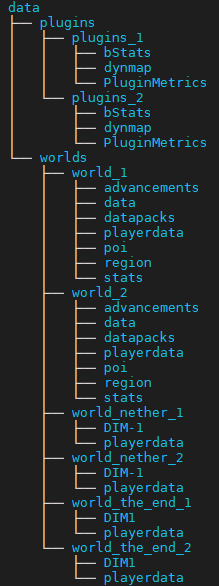

# Minecraft
**VERSION FULL HAPROXY**

## Commandes
- make (pour build)
- make clean (pour destroy)

## Répertoire "data"
- Il faut recréer l'aborescence :

  

## Fichier ".env"
- Il faut recréer le fichier ".env" qui embarque les addresses IP des conteneurs Docker et les infos du S3. Par exemple :
```
PROJECT_NAME=Projet_de_ouf
NETWORK_SUBNET=192.168.1.0/24
MINECRAFT_1_IP=192.168.1.11
MINECRAFT_2_IP=192.168.1.22
HAPROXY_IP=192.168.1.33
RCON_IP=192.168.1.44
DOCKERCRAFT_IP=192.168.1.55
AWS_ACCESS_KEY_ID=SOME8AWS3ACCESS9KEY
AWS_SECRET_ACCESS_KEY=sUp3rS3cr3tK3y0fgr34ts3cr3cy
S3_BUCKET_URL=s3://bucket-fml/
AWS_DEFAULT_REGION=eu-west-3
CRON_SCHEDULE=0 * * * * #toutes les heures
BACKUP_NAME=Backup_worlds_and_plugins
```
